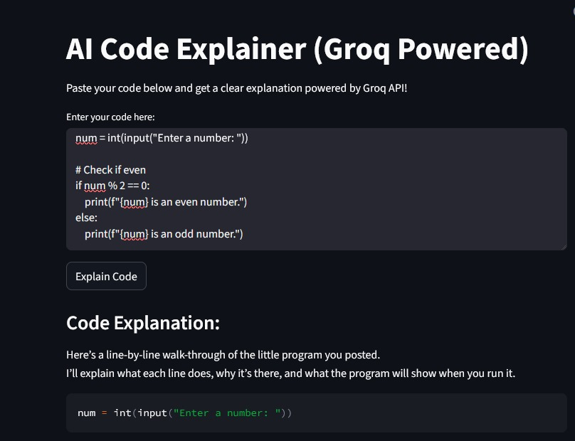

# AI Code Explainer

A user-friendly web application that explains code snippets in simple English, powered by Groq's AI API.

## streamlit link
 **Live Demo:** [Click here to view](https://aicodeexplainer-8jkyzzdwszb63hvfoswezq.streamlit.app/)

### screenshot

### Streamlit (UI)



## Features

- **Simple Interface**: Easy-to-use text input area for pasting code
- **Multiple Language Support**: Handles Python, JavaScript, and C++ code
- **Clear Explanations**: Provides line-by-line breakdown of code functionality
- **Fast Processing**: Powered by Groq's efficient AI model

## Setup

1. Clone the repository:
```sh
git clone https://github.com/yourusername/AI_code_explainer.git
cd AI_code_explainer
```

2. Install required packages:
```sh
pip install streamlit python-dotenv openai
```

3. Create a `.env` file in the project root and add your Groq API key:
```
GROQ_API_KEY=your_api_key_here
```

4. Run the application:
```sh
streamlit run code_explainer_app.py
```

## Usage

1. Launch the application using the command above
2. Paste your code into the text area
3. Click "Explain Code"
4. Read the detailed explanation provided by the AI

## Requirements

- Python 3.6+
- Streamlit
- python-dotenv
- openai
- Valid Groq API key

## Environment Variables

- `GROQ_API_KEY`: Your Groq API authentication key

## License

MIT License

## Contributing

Feel free to open issues and pull requests for any improvements!# AI_code_explainer